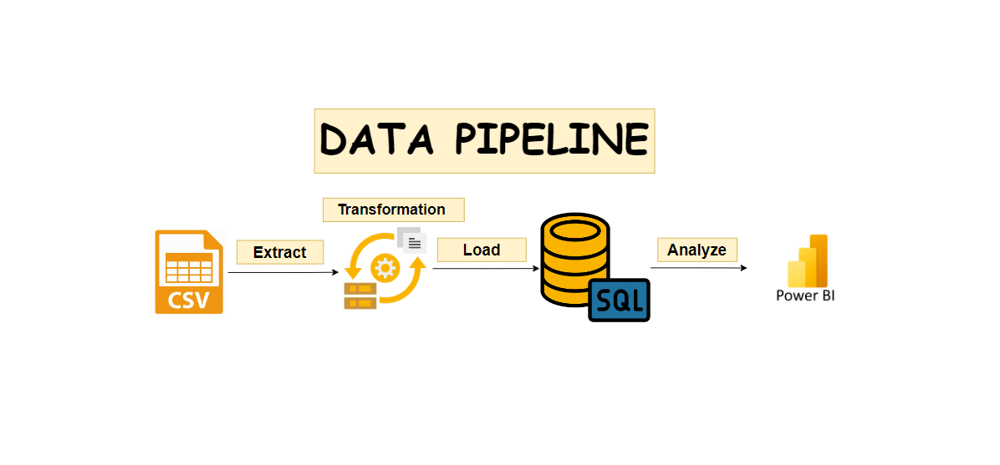
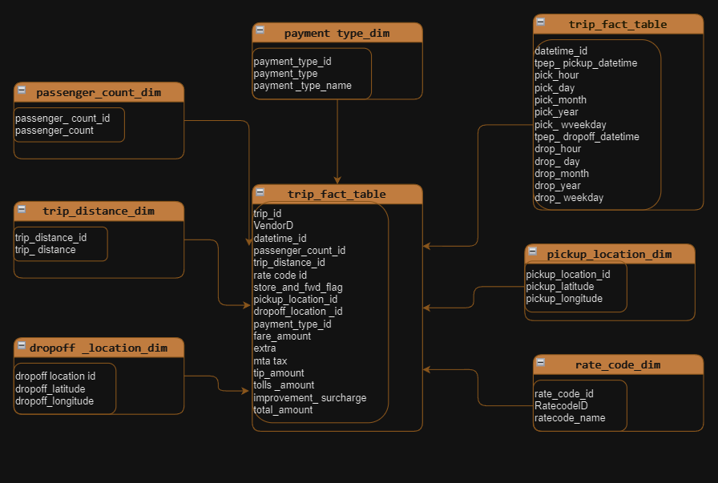

# Taxi Trip Data Analytics | e2e Data Engineering Project

## Introduction

The goal of this project is to perform data analytics on Uber data using various tools and technologies, including GCP Storage, Python, Compute Instance, Mage Data Pipeline Tool, BigQuery, and Looker Studio.

## Architecture 

## Dataset Used
TLC Trip Record Data
Yellow and green taxi trip records include fields capturing pick-up and drop-off dates/times, pick-up and drop-off locations, trip distances, itemized fares, rate types, payment types, and driver-reported passenger counts. 

-Dataset & Info about it : https://github.com/ahmedyouseff-19/Taxi-Trip-e2e-Project/tree/main/data

## Data Model

