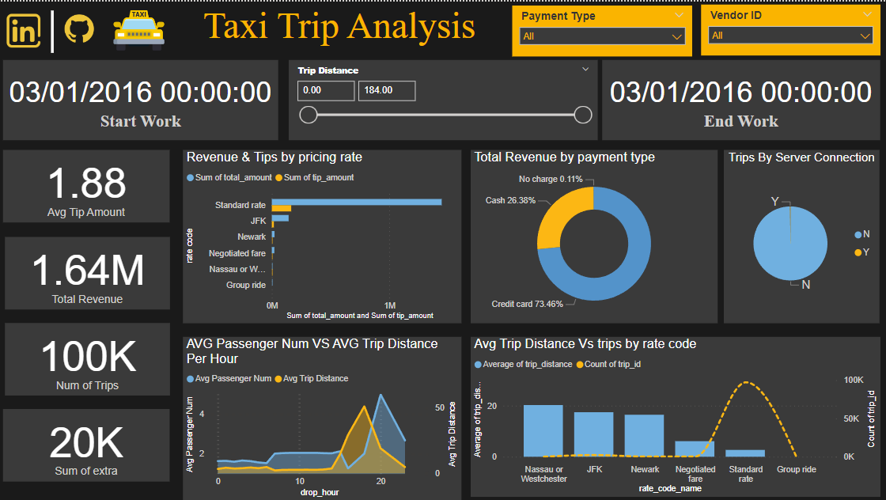

# Taxi Trip Data Analytics | e2e Data Engineering Project

## Introduction

The goal of this project is to perform data analytics on Taxi Trip data using various tools and technologies, including Python, Sql Server, MS Power BI .

## Architecture 

## Dataset Used
TLC Trip Record Data
Yellow and green taxi trip records include fields capturing pick-up and drop-off dates/times, pick-up and drop-off locations, trip distances, itemized fares, rate types, payment types, and driver-reported passenger counts. 

-Dataset & Info about it : https://github.com/ahmedyouseff-19/Taxi-Trip-e2e-Project/tree/main/data

## Data Model

## Data visualization

Report link: https://www.novypro.com/project/taxi-trip-analysis

